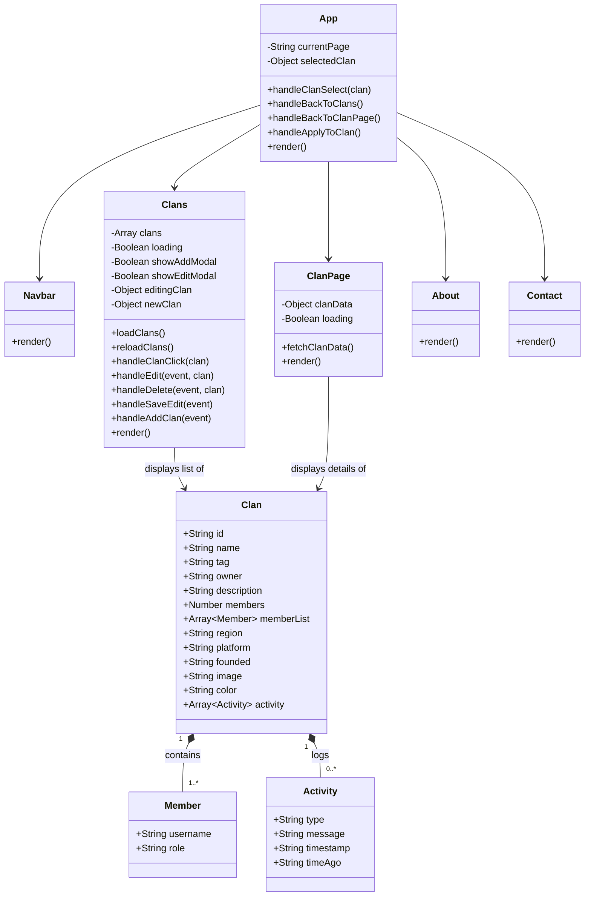
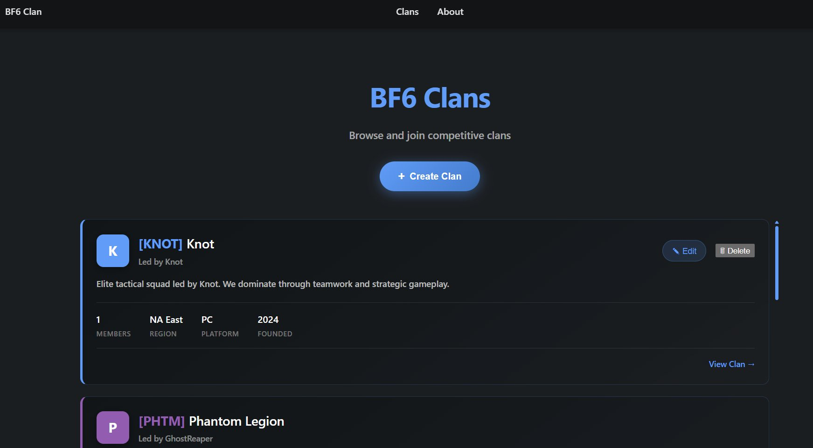
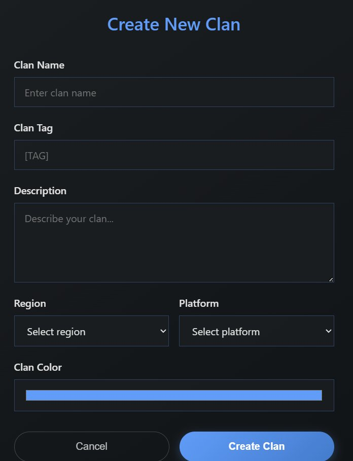
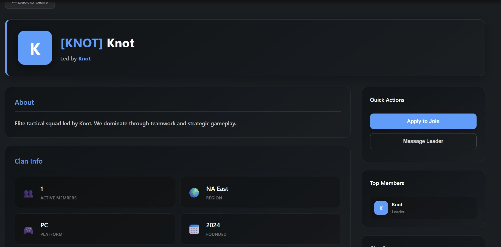

# BF6 Clan Application

## Introduction

This application is intended for users who wish to create, manage, and join Battlefield 6 clans within an online community. The main purpose is to provide a centralized platform where players can organize into groups, manage membership, and coordinate across different regions and platforms.

The primary functionalities of the application include:

- **Clan Management** – Users can create, edit, and delete clans with customizable details such as name, tag, description, region, platform, and color.
- **Clan Browsing** – Users can browse all available clans, view detailed clan pages with member lists, stats, and activity logs.
- **Membership System** – Players can join or leave existing clans, with member tracking and role-based hierarchy (Leader, Officer, Member).
- **Persistent Data Storage** – All clan data is stored in local JSON files, ensuring data persists across sessions without requiring an external database.

By using this application, users will benefit from an organized and intuitive way to find and manage gaming communities for Battlefield 6.

## Design

The application architecture is based on the following technologies:

- **Frontend:** React (with Vite as the build tool) – provides a modern, responsive single-page application interface.
- **Storage:** Local JSON files (`public/data/clans.json`) – stores clan data in a lightweight, file-based format with no external database required.
- **CLI Tools:** Node.js scripts for managing clans and members from the command line.

### Architecture Overview

The application is a client-side React SPA (Single Page Application) built with Vite. The frontend reads clan data directly from a static JSON file (`public/data/clans.json`). Clan and member management is handled through CLI scripts that read and write to the same JSON file, keeping the architecture simple and self-contained with no backend server required.

### Data Schema

**Clan** (stored in `public/data/clans.json`)
- `id` (String, unique identifier)
- `name` (String, required)
- `tag` (String, required)
- `owner` (String, owner username)
- `description` (String, required)
- `members` (Number, default: 1)
- `memberList` (Array of objects with `username` and `role`)
- `region` (String, enum: NA East, NA West, EU West, EU Central, Asia Pacific)
- `platform` (String, enum: PC, Xbox, PlayStation, Cross-play)
- `founded` (String, year)
- `image` (String, optional)
- `color` (String, default: '#4A9EFF')
- `activity` (Array of activity log entries)

### Role Hierarchy

Members within a clan have one of the following roles:

- **Leader** – Clan owner, full control over the clan. Only one per clan.
- **Officer** – Elevated permissions, can be promoted to Leader.
- **Member** – Standard member with basic access.

### Diagrams



## Implementation

To download and continue the development of the application, follow these steps:

### 1. Cloning the Repository

```bash
git clone https://github.com/knotbyt/BF6-application.git
cd BF6-application
```

### 2. Installing Dependencies

```bash
npm install
```

### 3. Running the Application

```bash
npm run dev
```

This starts the Vite development server. The application will be available at `http://localhost:5173`.

### Project Structure

```
BF6-application/
├── src/                 # Frontend code (React)
│   ├── App.jsx          # Main app component with routing
│   ├── Clans.jsx        # Clan listing, creation, editing, deletion
│   ├── ClanPage.jsx     # Individual clan detail page
│   ├── About.jsx        # About page
│   ├── Contact.jsx      # Contact page
│   ├── Navbar.jsx       # Navigation bar
│   ├── roles.js         # Role definitions
│   ├── App.css          # Application styles
│   └── main.jsx         # React entry point
├── public/              # Static assets
│   └── data/
│       └── clans.json   # Clan data (read by frontend)
├── server/              # CLI utility scripts
│   └── scripts/
│       ├── addMember.js
│       ├── kickMember.js
│       ├── addClan.js
│       ├── removeClan.js
│       ├── promoteMember.js
│       └── demoteMember.js
├── screenshots/         # Application screenshots
├── package.json
└── vite.config.js
```

### CLI Scripts

The application includes utility scripts for managing clans and members from the command line. All scripts search by clan name, ID, or tag (case-insensitive).

**Clan Management:**

```bash
# Add a new clan
npm run add-clan "Shadow Squad" "[SHDW]" "DarkKnight" "Stealth ops clan" "EU West" "PC"
npm run add-clan "Shadow Squad" "[SHDW]" "DarkKnight" "Stealth ops clan" "EU West" "PC" "#FF5733"

# Remove a clan
npm run remove-clan "Shadow Squad"
npm run remove-clan "[SHDW]"
```

**Member Management:**

```bash
# Add a member to a clan
npm run add-member "Knot" "player2"

# Remove a member from a clan
npm run kick-member "Knot" "player2"
```

**Role Management (Member → Officer → Leader):**

```bash
# Promote a member (Member → Officer → Leader)
npm run promote "Knot" "player2"

# Demote a member (Leader → Officer → Member)
npm run demote "Knot" "player2"
```

Promoting a member to Leader will automatically demote the current leader to Officer. Demoting a Leader requires at least one Officer in the clan to take over.

## Usage

### 1. Interface Navigation

The application features a React-based single-page interface with a navigation bar at the top for switching between the Clans page, About page, and Contact page.

### 2. Clan Browsing and Management

The main Clans page displays all available clans with their tag, name, owner, description, member count, region, platform, and founding year. Users can create new clans, edit existing ones, or delete them directly from this view.



### 3. Creating a Clan

Clicking "+ Create Clan" opens a form where users can enter the clan name, tag, description, region, platform, and a custom color.



### 4. Clan Detail Page

Clicking "View Clan" shows detailed information including an about section, clan stats (members, region, platform, founded), quick actions (apply to join, message leader), and a top members list.



## Conclusions and Next Steps

This application provides a robust solution for Battlefield 6 players looking to organize into clans and manage their communities. Users benefit from intuitive clan management and persistent file-based data storage. The application can be improved by:

- Adding new functionalities based on user feedback (e.g., clan chat, event scheduling, matchmaking integration).
- Optimizing performance for smoother usage with larger datasets.
- Adding search and filtering capabilities for browsing clans by region, platform, or member count.
- Implementing a backend server for multi-user support and real-time updates.
- Deploying to a production environment with proper CI/CD pipelines.

## Prerequisites

- Node.js (v16 or higher)

## License

MIT